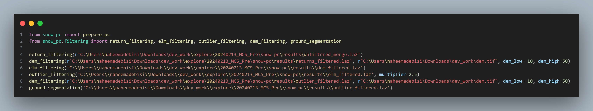

# Welcome to snow-pc

**A python package for automated processing of point clouds to simplify elevation creation, co-registration and differencing to facilitate the production of snow depth and vegetation products.**

-   Free software: MIT license
-   Documentation: https://Surfix.github.io/snow-pc
    
## Introduction and statement of Need
Light Detection and Ranging (LiDAR) and Structure from Motion (SfM) photogrammetry currently provide the most advanced and accurate approaches for monitoring snow distribution across a range of platforms, scales, and repeat intervals. These techniques generate high-resolution digital elevation models (DEMs) by producing georeferenced point clouds from overlapping imagery in the case of photogrammetry or from high frequency laser pulses in the case of LiDAR. However, post-processing of point clouds for generation of snow depth rasters remains complex compared to many other earth science applications such as topographic mapping, vegetation monitoring, geomorphology and landform analysis. Existing point cloud processing software suite such as [Point Data Abstraction Library (PDAL)](https://pypi.org/project/pdal/) and LAStools provide general purpose tools for pre-processing, filtering and analyzing large point cloud data. Yet, there is a lack of tool that leveraged these capacities for optimized automated workflows specifically tailored for snow and ice applications. Consequently, complex manual interventions are often required for tasks like merging point cloud files from different flight lines or acquisitions, point clouds filtering, construction of (DTMs), aligning the DTMs and generation of products. This hinders efficient production of snow depth and limits full utilization of rich information in point clouds datasets.  

snow_pc addresses this challenge by leveraging pdal and Stereo Pipeline (ASP) to automate point clouds management in a standardized workflow for generating elevation models, snow depths and vegetation products. This allows diverse users of developers, data processors and snow scientists to automate core point clouds processing tasks like merging, coordinate transformations, classification, co-registration and rasterization to simplify effort and facilitate multi-temporal analysis.

## Usage
To learn more about snow_pc, check out the snow_pc [api reference](https://surfix.github.io/snow-pc/snow_pc/) on the documentation website- https://Surfix.github.io/snow-pc

## Key Features
### Prepare Module
- `replace_white_spaces(in_dir)` : remove white spaces in the point cloud files. 
- `las2laz(in_dir)` : Takes a user directory full of las files and convert the files to LAZ files. LAZ is a compressed version of LAS so it provides optimal data transfer and computation efficiency.
- `merge_laz_files(in_dir)`: merge all LAZ files in the project directory into one LAZ file. This step is crucial for mosaicking point cloud data from different flight lines to ensure seamless coverage over the area of interest, simplify data management tasks and facilitate processing in subsequent commands that take a single point cloud file. 

### Filtering module
- `return_filtering(laz_fp)` : removes points with invalid returns where the return number or number of returns is zero. This is only required for LiDAR point clouds. 
- `dem_filtering(laz_fp)` : extracts only points within a defined elevation range relative to the reference DEM. This filter is important to remove atmospheric or MTA noise from the data thereby eliminating outlier points too far above or below the ground surface.
- `elm_filtering(laz_fp)` : finds isolated low points that are likely errors or noise far below the actual ground level.
- `outlier_filtering(laz_fp)` : removes extreme outlier points in the point cloud that deviate significantly from surrounding points.
- `ground_segmentation(laz_fp)` : Classify the terrain points using the Simple Morphological Filter (SMRF) algorithm
- `surface_segmentation(laz_fp)` : Isolate the surface points from the point clouds

### Modeling module
- `terrain_models(laz_fp)` : Use filters.dem, filters.mongo, filters.elm, filters.outlier, filters.smrf, and filters.range to filter the point cloud for terrain models [Todo: Refactor to leverage the filtering module]
- `surface_models(laz_fp)` : Use filters.dem, filters.mongo and filters.range to filter the point point cloud for surface points [Todo: Refactor to leverage the filtering module]

### Align module
- `clip_pc(in_laz, buff_shp)` : Clip the point cloud to a shapefile. [To do]
- `pc_align(in_laz, dem)`: Align the point clouds to a reference [To do]

### Product module
- `generate_product(dtm_file, dsm_file)`: Derive snow depth and canopyheight from DTM and DSM files [To do]

### Snow_pc module
- `prepare_pc(in_dir)` : Steps through all preparing tools in one call
- `laz2uncorrectedDEM(laz_fp)` : steps through all tools in prepare, filtering and modeling modules to generate dtm and dsm in one call
- `laz2correctedDEM(laz_fp)` : steps through all tools in prepare, filtering, modeling and aligning modules to generate co-registered dtm and dsm in one call
- `snowpc_pipeline(in_dir)`: steps through all tools in prepare, filtering, modeling, align and product module to derive snow depth and vegetation height products

### Common module
 - `download_dem(las_fp)` : Download DEM within the bounds of the las file. [Currently in snow_pc module]
 

##  TODO
- [x] Add ground segmentation function to the filtering module
- [] Refactor the modeling module 
- [] Refactor the clip_pc moduile and add pc_align function to align module (ASP does not support windows distribution???)
- [] Refactor the snow_pc module (move download_dem function to common module, Merge all steps into one call)
- [x] Complete surface segmation function to the filtering module
- [] Use a better algorithm than first return isolation for the surface_segmentation (filtering_module)
- [] Improve the segmentation accuracy for photogrammetry point clouds
- [] Add a novel approach for combining LiDAR and photogrammetry point clouds
- [] Add interactive map feature to allow users draw control surface for coregistration
- [] Implement coregistration using points
